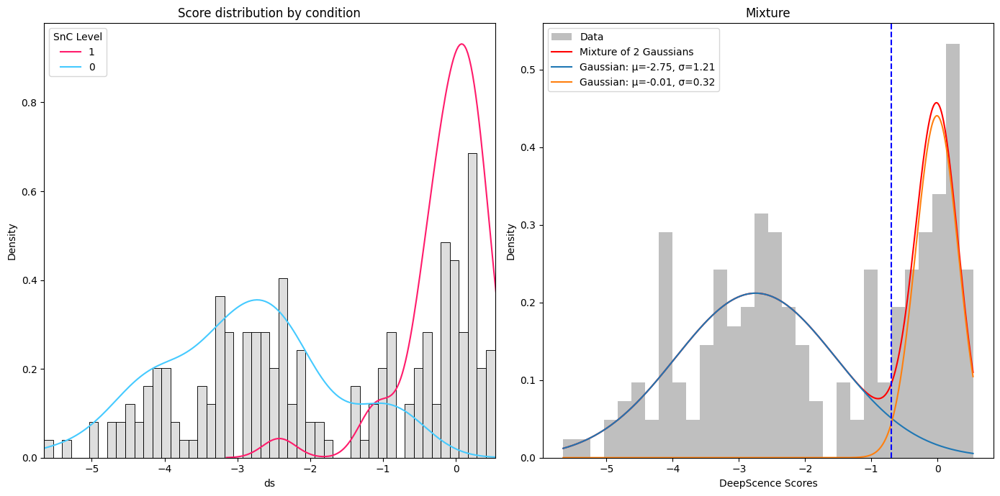
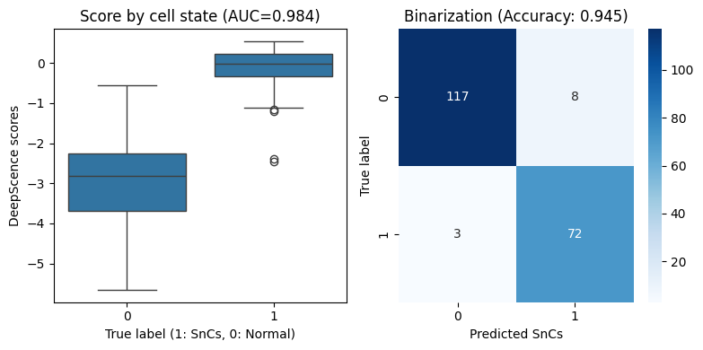
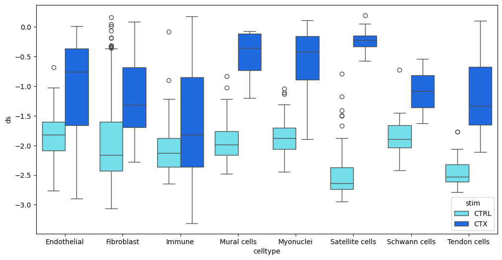

# DeepScence Tutorial

## Table of Contents

<div style="font-size:1.3em">

- [1. Intro](#1-intro)  
- [2. Example: In-vitro IMR-90 dataset](#2-example-in-vitro-imr-90-dataset)  
  - [2.1 Prepare input for DeepScence](#21-prepare-input-for-deepscence)  
  - [2.2 Run DeepScence & Visualize](#22-run-deepscence--visualize)  
- [3. Example: In-vivo mouse muscle data](#3-example-in-vivo-mouse-muscle-data)  
  - [3.1 Prepare input for DeepScence](#31-prepare-input-for-deepscence)  
  - [3.2 Run DeepScence & Visualize](#32-run-deepscence--visualize)  
- [4. Working with mouse data and other parameters](#4-working-with-mouse-data-and-other-parameters)  

</div>


```python
import scanpy as sc
import numpy as np
import seaborn as sns
import pandas as pd
import matplotlib.pyplot as plt

from DeepScence.api import DeepScence
from dca.api import dca
```

### 1. Intro
DeepScence is an unsupervised machine learning model based on autoencoders for accurately scoring and identifying senescent cells in single-cell RNA-seq (scRNA-seq) and spatial transcriptomics datasets.

DeepScence take as input a properly filtered, ideally denoised expression matrix in the form of `AnnData` object. If start with raw count matrix, we recommend performing denoise using `DCA` or other methods first. 

DeepScence outputs:
- A continuous senescence score (`adata.obs["ds"]`)
- A binary classification for senescent cells and normal cells (`adata.obs["binary"]`)

<div style="border: 2px solid #f39c12; padding: 10px; border-radius: 5px; background-color: #fcf8e3; color: black;">
<b>Note:</b><br>
For datasets collected from cell lines where only one cell type is present, please refer to the IMR-90 example below.<br>
For datasets collected in vivo where multiple cell types are present, please refer to the second example for controlling unwanted covariates.
</div>


## 2. Example: In-vitro IMR-90 dataset
This is an in-vitro scRNA-seq dataset for IMR-90 cell line, with senescence induced by OSKM factors. Senescence information of cells are labeled as ground truth. Note this data set has only one cell type that is IMR-90.


### 2.1 Prepare input for DeepScence


```python
counts = pd.read_csv('./origin_matrix_GSE94980.txt', sep = '\t').T
adata = sc.AnnData(counts)
adata.obs['condition'] = [x.split('_')[-1]=='OSKM' for x in adata.obs_names]
adata.obs["SnC"] = (adata.obs["condition"]).astype(int)
adata.X = adata.X.astype(np.float32)

# denoise
sc.pp.filter_genes(adata, min_cells=1)
dca(adata)
```

    dca: Successfully preprocessed 16871 genes and 200 cells.
    dca: Calculating reconstructions...


### 2.2 Run DeepScence and visualize


```python
adata = DeepScence(adata, binarize=True)
```

    [2025-08-13 20:26] GPU not available, using CPU...
    [2025-08-13 20:26] Input is not count, processed 16871 genes and 200 cells.
    [2025-08-13 20:26] Using 35 genes in the gene set for scoring.
    [2025-08-13 20:26] Lambda provided, capturing scores in 2 neurons.
    [2025-08-13 20:26] Training on 180 cells, validate on 20 cells.
    100%|██████████| 300/300 [00:01<00:00, 289.93it/s]


    

    


```python
from sklearn.metrics import roc_auc_score, confusion_matrix, accuracy_score
import matplotlib.pyplot as plt

binary_numeric = adata.obs["binary"].map({"SnC": 1, "Normal": 0}).values
auroc = roc_auc_score(adata.obs["SnC"].values, adata.obs["ds"].values)
accuracy = accuracy_score(binary_numeric, adata.obs["SnC"])

fig, (ax1, ax2) = plt.subplots(1, 2, figsize=(8, 4))
sns.boxplot(x=adata.obs["SnC"], y=adata.obs["ds"], ax=ax1)
ax1.set_title(f"Score by cell state (AUC={auroc:.3f})")
ax1.set_xlabel("True label (1: SnCs, 0: Normal)")
ax1.set_ylabel("DeepScence scores")

cm = confusion_matrix(binary_numeric, adata.obs["SnC"])
sns.heatmap(cm, annot=True, fmt='d', cmap='Blues', ax=ax2)
ax2.set_title(f"Binarization (Accuracy: {accuracy:.3f})")
ax2.set_xlabel("Predicted SnCs")
ax2.set_ylabel("True label")

plt.tight_layout()
plt.show()
```

    2025-08-13 20:27:00,189 [INFO] Using categorical units to plot a list of strings that are all parsable as floats or dates. If these strings should be plotted as numbers, cast to the appropriate data type before plotting.
    2025-08-13 20:27:00,192 [INFO] Using categorical units to plot a list of strings that are all parsable as floats or dates. If these strings should be plotted as numbers, cast to the appropriate data type before plotting.


    

    


## 3. Example: In-vivo mouse muscle data
This is an in-vivo scRNA-seq dataset collected from mouse muscle, with senescence induced by cardiotoxin (CTX). `adata.obs["stim"] == "CTX"` represents the injured condition, which is more enriched in senescent cells.

Since multiple cell types are present in this dataset, it is important to control for cell type variation when running DeepScence. To do this, assign additional column by setting `adata.obs["b"] = adata.obs["celltype"]` so that DeepScence treat cell types as “batch” groups. During training, DeepScence minimizes the maximum mean discrepancy (MMD) between these groups in the latent space. This ensures that the senescence scores are not confounded by cell type–specific variation and is recommended when dealing with in-vivo datasets.

### 3.1 Prepare input for DeepScence


```python
adata = sc.read_h5ad("./mouse_muscle.h5ad")
sc.pp.filter_genes(adata, min_cells=1)
dca(adata) # This step might take some time...
```

    dca: Successfully preprocessed 14946 genes and 3591 cells.
    dca: Calculating reconstructions...


### 3.2 Run DeepScence and Visualize


```python
# running mouse dataset
adata.obs["b"] = adata.obs["celltype"].astype(str)
adata = DeepScence(adata, binarize=False, species="mouse")

```

    [2025-08-13 20:28] GPU not available, using CPU...
    [2025-08-13 20:28] Input is not count, processed 14946 genes and 3591 cells.
    [2025-08-13 20:28] Using 35 genes in the gene set for scoring.
    [2025-08-13 20:28] Lambda provided, capturing scores in 2 neurons.
    [2025-08-13 20:28] Training on 3232 cells, validate on 359 cells.
     89%|████████▉ | 268/300 [00:10<00:01, 26.76it/s]


```python
# Plot senescence score distributions comparing conditions
plt.figure(figsize=(12, 6))
sns.boxplot(
    data=adata.obs,
    x="celltype",
    y="ds",
    hue="stim",
    palette=["#60efff", "#0061ff"]
)
plt.show()
```


    

    


## 4. Working with mouse data and other parameters

1. When working with mouse data like the one above, set `species="mouse"` when running **DeepScence**.  
2. **DeepScence** uses the **CoreScence** gene signature list by default. If you want to test out another list of genes, use:  

```python
genelist = ["CDKN1A", "IL6", ...]
adata = DeepScence(adata, custome_gs=genelist)
